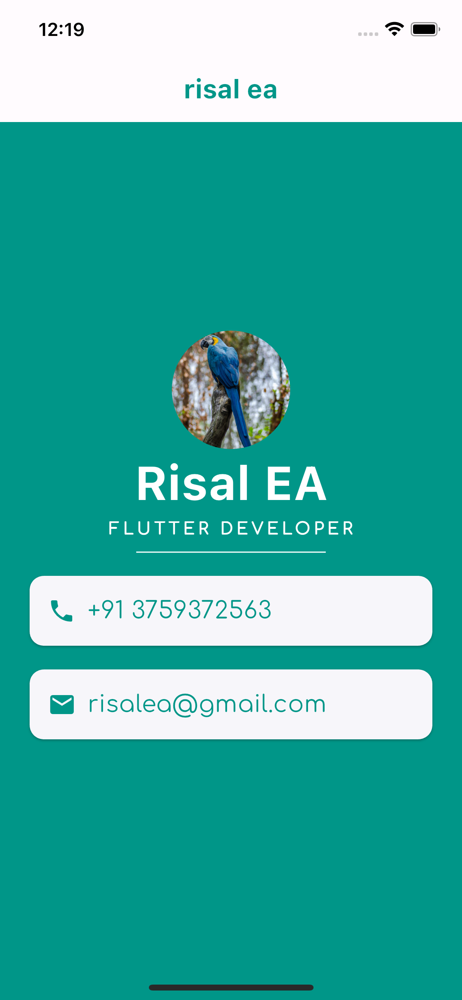

# Flutter Profile App

A simple Flutter application showcasing a developer profile.

## Description

This Flutter application displays a developer's profile with basic information such as name, profession, contact details, and a profile picture.

## Screenshots

## Features

- Displays developer's name and profession
- Shows contact details (phone number and email)
- Uses a stylish UI design with themed colors

## Usage

- Update the profile details in the code to reflect your own information.
- Customize the UI design and colors to suit your preferences.

## Technologies Used

- Flutter
- Dart
